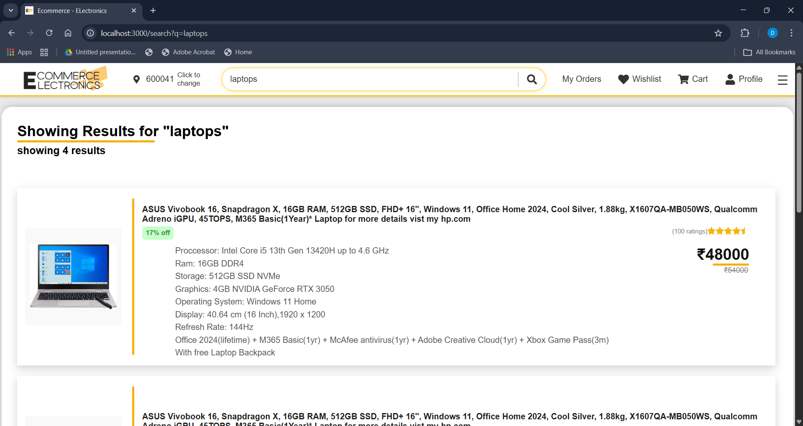
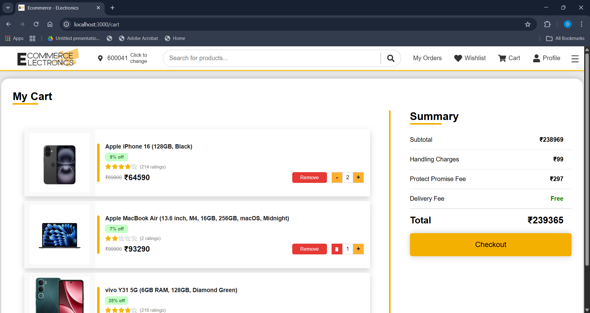
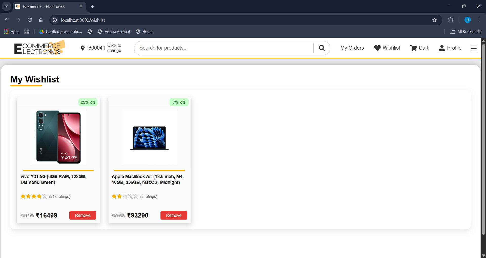
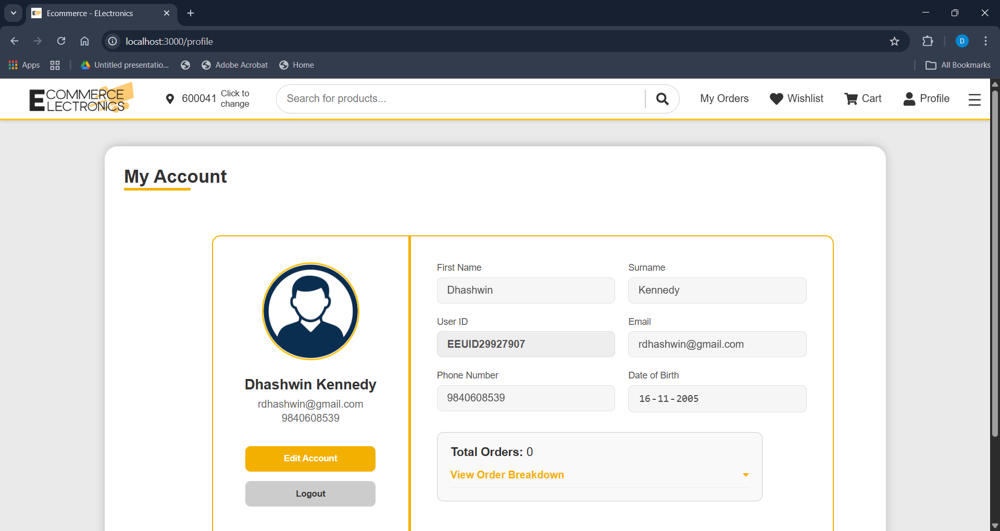
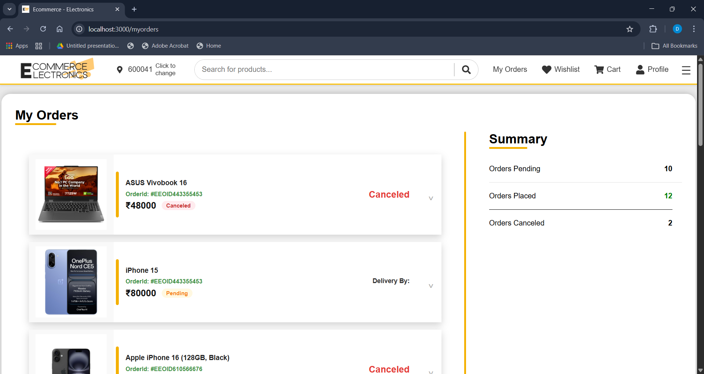
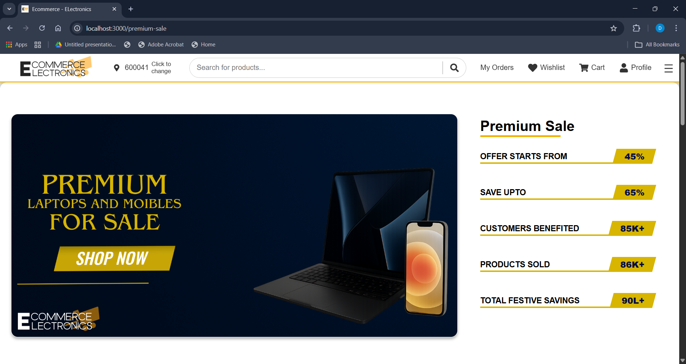
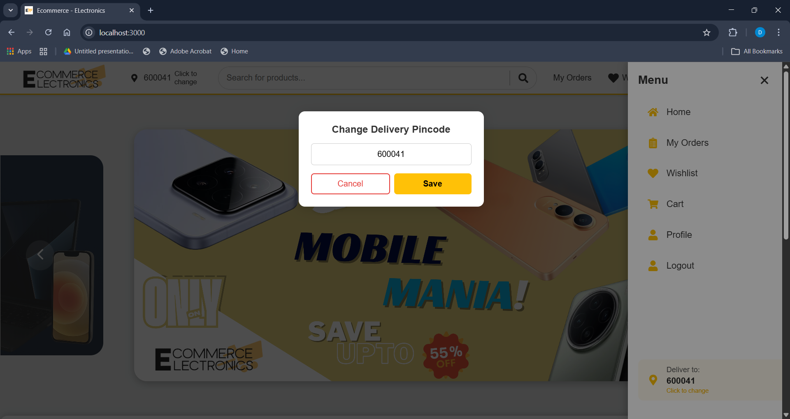

# Ecommerce-Electronics 🛒

A full-stack e-commerce platform for buying and selling electronic gadgets.

## 🚀 Features

- User Authentication (Login/Signup)
- Product Search and Filtering
- Shopping Cart functionality
- Responsive UI for mobile and desktop

## 🛠️ Tech Stack

- **Frontend:** React.js
- **Backend:** Node.js, Express.js
- **Database:** MongoDB
- **State Management:** Redux or Context API

## 📦 Installation

1. Clone the repository:
   `git clone https://github.com/your-username/Ecommerce-Electronics.git`
2. Install dependencies for the frontend and backend:
   `npm install`

3. Setup Database (Automated ⚡)
   -> 1. **Create and Activate Virtual Environment:**

   ```bash
   python -m venv venv
   # Windows: .\venv\Scripts\activate
   # Mac/Linux: source venv/bin/activat

   -> 2. Install Dependencies: pip install pymongo

   -> 3. Run the Initializer: python main.py
         Follow the terminal prompts to validate your database name and connect to your Cluster.

   ```

4. Start the development server:
   `npm start`

## 📸 Project Screenshots

### 🏠 Home & Discovery

|                Home Page                |                 Search Page                 |
| :-------------------------------------: | :-----------------------------------------: |
|  |  |

### 🛒 Shopping Experience

|                Cart Page                |                  Wishlist Page                  |
| :-------------------------------------: | :---------------------------------------------: |
|  |  |

### 👤 User Account & Orders

|                 Account Page                  |                 Orders Page                 |
| :-------------------------------------------: | :-----------------------------------------: |
|  |  |

### 🛠️ Features & Updates

|                Events Page                |                  Drawer & Pincode Update                   |
| :---------------------------------------: | :--------------------------------------------------------: |
|  |  |

## 📝 License

MIT
